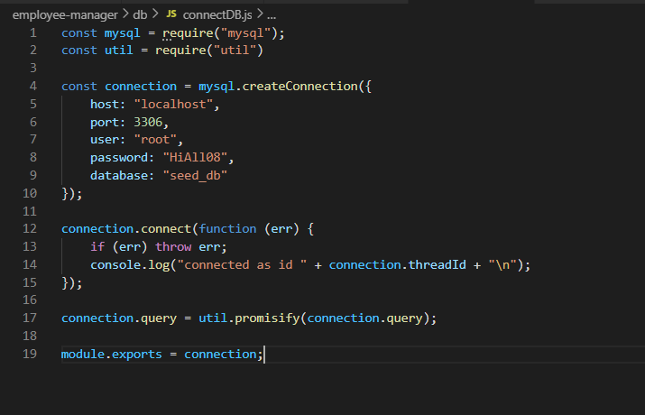
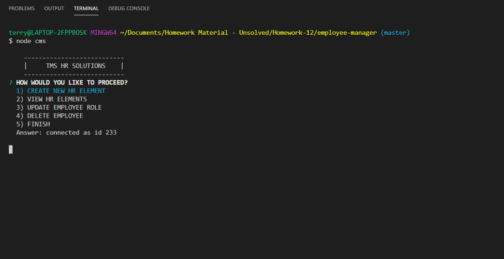
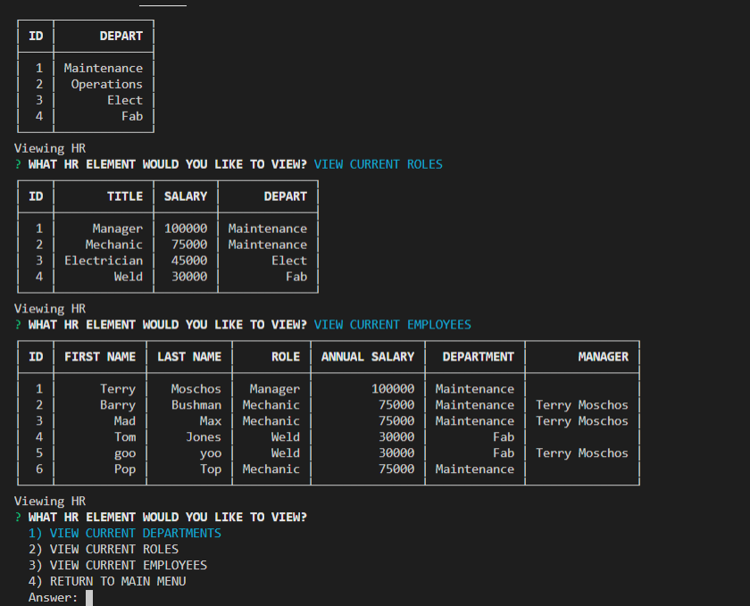

# Employee-Manager 
  

  ## Description ✏️
  
  Employee-Manager allows you to take control of your HR elements by adding departments, Roles and Employees.  You can view each element and also update employee roles.
  
  ## Table of Contents 📚
  
  * [Installation](#installation)
  * [Usage](#usage)
  * [License](#license)
  * [Contributing](#Contributing)
  * [Testing](#Testing)
  * [Questions](#Questions)
  
  ## Installation 

  ```
  📥 
  Download Employee-Manager package and run npm install to install required modules.  The app is then used from the terminal.
  You will need mySQL workbench and run the sql files inside mySQL workbench.  You will also need to create the connection so ensure the connectDB.js file is up to date with the required information from mySQL workbench.
  ```
 

  ## Usage 

  ```
  ▶️ 
  run node cms.js => then you will be prompted with choices to add, view or update HR elements.  The app is intuitive so all you need to do is follow the prompts and make selections by using the up and down arrows on the keypad and pressing enter and if prompted for input, simply type required name or text  and press enter.  Its that simple.
  ```
 
 
  ## License 
  
  📜 License Code: GPL-2.0

  For detailed information on license [Click Here](https://opensource.org/licenses/GPL-2.0)
  
  ## Contributing
  
  👌 No contribution at this point
  
  ## Testing 

  ```
  ✔️ 
  Ensure the connection has been made and you can see the console log for a mySQL connection in the terminal.
  Once an action such as add or update has been completed go to view and ensure the element added or updated is correct.
  ```

  ## Questions 
  
  Direct questions to me via email 📧 at [tmoschos@bigpond.com](tmoschos@bigpond.com).  Please use "Employee-Manager questions" in the subject and I will hopefully return a response within 48hrs.

  More information can be found at my [GitHub Profile](https://github.com/emoschos).
  
---
This README was created by the "Great-Read" 📝 Node.js app.  Developed by Eleftherios Moschos
